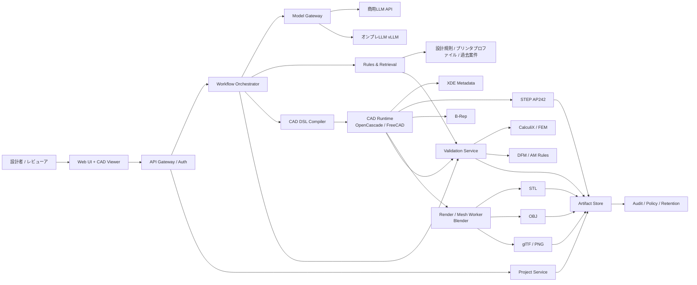
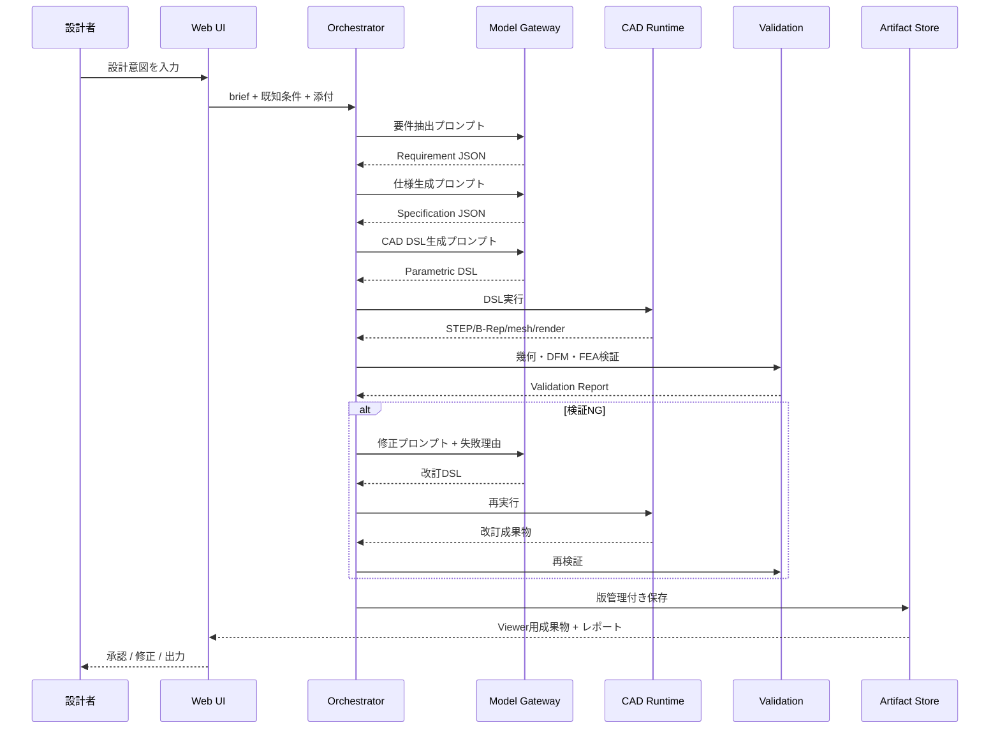
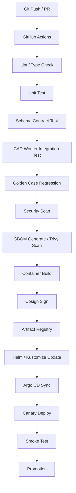

# 生成AI活用機械設計プラットフォーム設計書

## エグゼクティブサマリ

本件で最も重要なのは、LLMに直接「完成CAD」を一発生成させるのではなく、**要件の構造化 → 仕様化 → 安全なパラメトリックDSL生成 → CADカーネル実行 → 幾何検証・造形検証・必要に応じたFEA → STEP/STL/OBJなどへの派生出力**という多段パイプラインにすることです。機械設計の主流は依然としてパラメトリックCADであり、SketchGraphs は拘束付きスケッチ、DeepCAD はCAD操作列、Text2CAD は自然言語からパラメトリックCADへの変換、CADFusion はシーケンス信号と視覚信号の両方の重要性を示しています。さらに近年のCADエージェント研究では、**見た目の整合だけでなく、幾何チェックと有限要素解析を含む構造化フィードバック**が性能向上に有効だと示されています。したがって、実運用では「LLMは設計意図を構造化し、CADカーネルと検証器が真偽を決める」設計が最も堅実です。citeturn38view5turn39view1turn39view0turn38view2turn38view4turn38view3

本設計書の推奨アーキテクチャは、**ハイブリッド構成**です。高難度の自然言語解釈や仕様矛盾解消には商用APIを使い、機密性の高い案件や継続的な大量処理ではオンプレまたは自社クラウド上のオープンウェイトモデルを使います。オンプレ側は vLLM の OpenAI互換サーバを使えば上位アプリケーションのAPI契約を揃えやすく、KServe は Kubernetes 上で生成系モデルのサービング、オートスケール、カナリア、A/B、OpenAI仕様サポートを提供し、Argo CD は Git を正とした継続的デリバリを担えます。GitHub Actions は自動ビルド・テスト・デプロイに加えてセルフホストランナーも使えるため、CAD/FEAテストやGPU依存テストとの相性が良いです。citeturn25view2turn25view3turn25view4turn25view5

CAD基盤としては、**Open CASCADE Technology を中核カーネル**に据えるのが最も実装しやすいです。OCCT は STEP/IGES/STL などのデータ交換、XDE による色・レイヤ・名称・材料などの追加属性、Shape Healing による形状修復を備えています。FreeCAD は OCCT ベースで広い Python API を持ち、ヘッドレス実行も可能なので、サーバサイドのCADワーカーとして適しています。FreeCAD公式ドキュメントは STEP を「solid geometry と NURBS を保持できる最も忠実な交換形式」と位置づけ、OBJ/STL は三角形メッシュへ変換されることを明示しています。Blender は Python API とバックグラウンド実行を備えており、レンダリングやメッシュ後処理に向きます。Fusion は CAD/CAM/CAE/PCB 統合の強みがある一方でクラウド前提であり、一部のエクスポートはクラウド変換を要するため、完全なエアギャップ要件には不向きです。citeturn23view2turn25view0turn25view1turn24search1turn24search0turn33search1turn17search0turn17search1turn0search2turn0search6turn32search0turn32search8turn31search0

法務・セキュリティ面では、日本国内運用を前提にしても早い段階から統制が必要です。個人情報が混在する場合、PPCの通則編は組織体制、規律に従った運用、取扱状況確認手段、漏えい対応体制などの安全管理措置を求めています。外国にある第三者への個人データ提供では、国名、現地制度、受領者の保護措置に関する情報提供と同意が必要になる場合があります。文化庁は AI と著作権の考え方を公表しており、学習・利用可否は著作権法だけでなく、契約と機密保持も合わせて確認すべきです。さらに機械設計データは、用途次第で安全保障貿易管理上の「技術提供」に当たり得るため、該非判定とキャッチオール規制をワークフローに組み込むべきです。生成AIアプリ全般のリスクとしては、OWASP が Prompt Injection、Sensitive Information Disclosure、Improper Output Handling を主要論点に挙げています。citeturn28search0turn28search6turn26view3turn27view2turn26view4turn26view5turn26view6turn26view8turn35search0turn35search1

## 設計前提と要求定義

現時点でユーザーのスキル、対応フォーマット、必要公差、3Dプリンタ種別、オンプレ/クラウド条件が未確定なので、プラットフォームは**固定要件ではなくプロファイル駆動**で設計するべきです。とくに機械設計では、形状仕様と製造仕様が分離できないため、最初から「設計意図」「製造プロセス」「検証レベル」を別オブジェクトとして管理する必要があります。パラメトリックCADは拘束・寸法・操作列の概念を持つため、仕様未確定の状態を保持しながら後続の修正に耐えやすく、研究面でもパラメトリック表現が主要表現として扱われています。citeturn38view5turn39view1turn39view0

推奨する既定前提は次のとおりです。

| 項目 | 推奨既定値 | 実務上の意味 |
|---|---|---|
| 操作モード | ガイド付き / 設計者 / エキスパート の三段階 | スキル未指定でも導入しやすい |
| 正本データ | 要件JSON + 仕様JSON + パラメトリックDSL + STEP AP242 | LLM出力とCAD実体を分離し、監査可能にする |
| 派生データ | STL / OBJ / glTF / PNG / PDF図面 | 造形・レビュー・共有に最適化 |
| 公差管理 | グローバル固定値ではなく、工程プロファイルごと | FDM/SLA/SLSや材料で精度が変わるため |
| 製造プロファイル | FDM / SLA / SLS / CNC / 未定義 | DFM/AMルール切替の単位 |
| 配備方針 | 初期はハイブリッド、機密案件はオンプレ優先 | スピードとデータ統制を両立 |

この既定値の根拠は明確です。STEP は solid geometry と NURBS を保持できる交換形式であり、OCCT も STEP AP242 と XDE をサポートしています。一方、OBJ/STL はメッシュ表現で、FreeCAD では solids / NURBS ベースのオブジェクトがエクスポート時にメッシュへ変換されます。したがって、**編集・再生成・差分管理の正本は STEP/B-Rep とパラメトリック情報に置き、STL/OBJ は派生物として扱う**のが妥当です。citeturn23view2turn33search1turn25view0

造形精度・公差を一律指定しない理由も同じです。Formlabs は SLA の wall thickness や形状サイズ別の代表的公差を公開しており、たとえば Form 4 世代では 1–30 mm 特徴に対し ±0.15%（下限 ±0.02 mm）の代表値を示しています。UltiMaker は FDM/FFF において最小肉厚がノズルや層条件に依存し、一般に wall thickness や印刷条件が精度に大きく影響すると説明しています。短く言えば、**公差は「モデル属性」ではなく「工程属性」**として持つべきです。citeturn12search0turn12search6turn12search1turn12search10turn34search4turn34search1

実務上の成功指標は、文章生成品質ではなく、以下の工学的KPIで定義するのが良いです。

| KPI | 推奨目標 |
|---|---|
| 構造化要件JSONの妥当率 | 99%以上 |
| simple part の初回CADコンパイル成功率 | 80%以上 |
| 仕様→STEP 生成成功率 | 95%以上 |
| 幾何妥当性チェック通過率 | 98%以上 |
| DFM/AM ルール通過率 | プロファイル別に管理 |
| 重要案件の人手レビュー完全実施率 | 100% |
| 監査ログ欠損率 | 0% |

## 推奨アーキテクチャ

### 主要コンポーネントと責任分担

推奨アーキテクチャは、**Model Gateway + Orchestrator + Deterministic CAD Runtime + Validation Loop** の四層を中心に組みます。LLM 側は Structured Outputs と Function Calling を使って JSON Schema 準拠の出力だけを返し、下流では自由文を直接実行しません。OpenAI は Structured Outputs で JSON Schema 準拠を保証できると案内しており、Function Calling は外部機能接続の基本機構です。オンプレでは vLLM が OpenAI互換HTTPサーバを提供するため、商用APIとオンプレを同一契約で抽象化しやすいです。OWASP の観点でも、Prompt Injection と Improper Output Handling を避けるために、**自由文ではなく構造化DSLを受け渡す**のが安全です。citeturn25view8turn25view9turn25view2turn26view8turn35search1

| コンポーネント | 主責務 | 推奨技術 |
|---|---|---|
| Web UI / CAD Viewer | 要件入力、差分表示、レビュー承認 | React / Next.js + three.js 系 viewer |
| API Gateway / Auth | 認証認可、テナント境界、監査ID付与 | FastAPI / Kong / Keycloak など |
| Project Service | 案件、版、承認状態、アクセス権管理 | PostgreSQL |
| Requirement Extractor | 自由文を要件JSONへ変換 | 商用API / オンプレLLM |
| Spec Composer | 不足項目抽出、仮定作成、仕様JSON生成 | LLM + ルールエンジン |
| Retrieval Service | 設計ルール、過去仕様、プリンタプロファイル検索 | PostgreSQL + pgvector か同等 |
| CAD DSL Compiler | 仕様JSON→安全な操作列/DSL へ変換 | Python service |
| CAD Runtime | DSL実行、B-Rep/STEP 生成、属性埋込み | OCCT / FreeCAD headless |
| Render / Mesh Worker | レンダリング、STL/OBJ/glTF 派生生成 | Blender background |
| Validation Service | 幾何妥当性、寸法照合、DFM/AM、FEA | OCCT checks + FreeCAD FEM/CalculiX |
| Export Service | STEP/STL/OBJ/PDFなどのパッケージ出力 | OCCT / FreeCAD / Connector |
| Model Gateway | 商用API・オンプレを抽象化 | OpenAI API + vLLM |
| Policy / Audit Service | ルーティング規則、ログ、法規タグ、保持期間 | OPA / Postgres / Object Storage |
| Observability | Token、ジョブ、失敗要因、SLO監視 | OpenTelemetry / Prometheus / Grafana |

### 技術スタック比較

工具選定の前提として、OCCT はデータ交換・XDE・Shape Healing を持つ中核カーネル、FreeCAD はヘッドレス/Pythonワーカー、Blender はバックグラウンドレンダリング、Fusion は統合CAD/CAM/CAEだがクラウド依存がある、という役割分担が最も自然です。citeturn23view2turn25view0turn25view1turn24search1turn24search0turn17search0turn17search1turn32search0turn32search8

| スタック案 | 構成 | 利点 | 欠点 | 導入コスト |
|---|---|---|---|---|
| OSS中核ハイブリッド | OCCT + FreeCAD + Blender + 商用API | 最短でPoC化しやすい。STEP正本・ヘッドレス実行・レンダリングが揃う。 | 商用API依存が残る。社外送信統制が必要。 | 低〜中 |
| 主権重視ハイブリッド | OCCT + FreeCAD + Blender + vLLM + KServe | データ主権を確保しやすい。API契約をOpenAI互換で統一できる。 | GPU運用、モデル評価、容量計画が必要。 | 中〜高 |
| 既存CAD統合型 | OCCT + FreeCAD + Fusion Connector + 商用API/オンプレLLM | 既存のAutodesk運用や下流CAM/CAEに乗せやすい。 | Fusionはクラウドベースで、一部エクスポートはクラウド変換を要する。完全オンプレには不向き。 | 中〜高 |
| 商用CADカーネル拡張型 | 商用Kernel + 専用コネクタ + LLM | 高度な既存CAD資産と親和性が高い。 | ライセンス費と結合度が高い。ベンダロックインが増える。 | 高 |

### アーキテクチャ図



この構成で一番重要なのは、**LLMの出力をそのまま Python/FreeCAD/Fusion API に流さず、いったん安全な DSL と検証済みパラメータに落とす**ことです。最近のCADエージェント研究でも、設計判断はエージェントが担い、実行・測定・構成・検証は決定論的コントローラが担う構成が有効とされています。実運用でも同じ考え方を採るべきです。citeturn38view3turn38view4

## データフローとAPI設計

### 正本データの定義

プラットフォーム内での正本データは、次の順序で持ちます。

| レイヤ | 正本 | 目的 |
|---|---|---|
| 要件 | Requirement JSON | 曖昧な自然言語を工学項目へ分解 |
| 仕様 | Specification JSON | 寸法、拘束、材料、工程、検証条件を確定 |
| 生成命令 | Parametric DSL / Operation Graph | LLMの出力を安全に実行可能化 |
| 形状 | STEP AP242 / B-Rep | 組立・交換・再利用の正本 |
| 派生物 | STL / OBJ / glTF / PNG / PDF | 造形、表示、共有、図面化 |
| 検証 | Validation Report JSON | 幾何/工程/FEAの判定と差分 |

このように多層化する理由は、研究的にもCADの価値が**見た目の3D形状だけでなく、拘束・操作列・設計履歴**にあるからです。DeepCAD と Text2CAD は操作列を直接扱い、SketchGraphs は拘束付きスケッチの重要性を示しています。加えて、STEP/XDE は幾何に付随する名称・色・材料なども運べるため、BOMやレビュー文脈の接続先として扱いやすいです。citeturn39view1turn39view0turn38view5turn23view2turn25view0

### データフロー



### サンプルAPI仕様

LLM工程には**全てJSON Schema契約**を敷き、運用ワーカーは非同期ジョブ型にします。Function Calling と Structured Outputs を前提にすると、商用APIでもオンプレAPIでもアプリ層が共通化しやすくなります。citeturn25view8turn25view9turn25view2

| エンドポイント | 用途 | 同期/非同期 |
|---|---|---|
| `POST /v1/projects` | 案件作成 | 同期 |
| `POST /v1/requirements/extract` | 自然文→要件JSON | 同期 |
| `POST /v1/specifications/generate` | 要件JSON→仕様JSON | 同期 |
| `POST /v1/cad/jobs` | 仕様→CAD生成ジョブ起動 | 非同期 |
| `GET /v1/cad/jobs/{job_id}` | ジョブ状態取得 | 同期 |
| `POST /v1/validation/jobs` | 既存成果物の検証 | 非同期 |
| `POST /v1/revisions` | 失敗理由を用いた再生成 | 非同期 |
| `POST /v1/exports` | STEP/STL/OBJ/PDF等の出力 | 同期 |
| `GET /v1/artifacts/{artifact_id}` | 成果物取得 | 同期 |

`POST /v1/requirements/extract`

```json
{
  "project_id": "prj_001",
  "brief": "直径25mmのパイプを固定するブラケット。M4で2点止め。FDMで試作したい。軽量だが十分な剛性が欲しい。",
  "locale": "ja-JP",
  "known_context": {
    "unit_system": "mm",
    "target_process": "FDM",
    "target_material": "PLA"
  }
}
```

レスポンス例:

```json
{
  "requirement_id": "req_001",
  "requirements": {
    "product_type": "single_part",
    "functional_requirements": [
      "pipe fixation",
      "two-point mounting",
      "lightweight with sufficient stiffness"
    ],
    "dimensions": {
      "pipe_outer_diameter_mm": 25,
      "fastener_type": "M4",
      "mounting_hole_count": 2
    },
    "manufacturing": {
      "primary_process": "FDM",
      "material_hint": "PLA"
    },
    "unknowns": [
      "allowable displacement",
      "mounting pitch",
      "service temperature",
      "preferred print orientation"
    ],
    "assumptions": [
      "prototype fit-check use case",
      "desktop FDM printer"
    ]
  }
}
```

`POST /v1/cad/jobs`

```json
{
  "project_id": "prj_001",
  "specification_id": "spec_014",
  "target_outputs": ["step_ap242", "stl", "obj", "png"],
  "validation_profile": {
    "manufacturing_profile": "fdm_standard",
    "tolerance_profile": "prototype_fit",
    "require_fea": false
  },
  "execution_policy": {
    "model_route": "hybrid",
    "allow_raw_code": false,
    "max_revision_loops": 3
  }
}
```

レスポンス例:

```json
{
  "job_id": "job_8842",
  "status": "queued",
  "estimated_steps": [
    "load_spec",
    "generate_dsl",
    "compile_cad",
    "render_preview",
    "run_validation",
    "package_artifacts"
  ]
}
```

`GET /v1/cad/jobs/job_8842`

```json
{
  "job_id": "job_8842",
  "status": "completed",
  "artifacts": {
    "step_ap242": "art_1001",
    "stl": "art_1002",
    "obj": "art_1003",
    "preview_png": "art_1004",
    "validation_report": "art_1005"
  },
  "validation_summary": {
    "geometry_valid": true,
    "dfm_pass": true,
    "fea_pass": null,
    "warnings": [
      "unsupported overhang area at local rib zone",
      "M4 hole diameter adjusted per FDM profile compensation"
    ]
  }
}
```

## LLMプロンプト設計

プロンプト設計では、**自由文をそのままCADコードにしない**ことが最重要です。OpenAI の Structured Outputs が JSON Schema 準拠出力を保証し、Function Calling が外部機能連携を支援します。セキュリティ面でも OWASP は Prompt Injection と Improper Output Handling を主要リスクに挙げているため、機械可読な安全契約を介在させるべきです。citeturn25view8turn25view9turn26view8turn35search1

### プロンプト設計原則

| 原則 | 実装方針 |
|---|---|
| 役割分離 | 要件抽出、仕様生成、DSL生成、検証、修正を別プロンプトに分割 |
| 構造化出力 | 全段階を JSON Schema で固定 |
| 単位固定 | `mm`, `deg`, `N`, `MPa` など単位系を明示 |
| 不明点の明示 | 推測を許す範囲と unknowns を区別 |
| 実行権限制限 | 既定は `allow_raw_code=false` |
| 再試行設計 | Validation Report を入力にした修正ループを実装 |
| 日本語優先 | ユーザー向け文は日本語、内部キーは英語スキーマでもよい |

### テンプレート集

#### 要件定義テンプレート

```text
[System]
あなたは機械設計の要件アナリストです。
役割は、自然言語の設計依頼を Requirement JSON に変換することです。
不足情報は unknowns に列挙し、危険な推測はしません。
出力は必ず schema requirement_v1 に一致させます。

[Developer]
優先順位:
1. 機能要件
2. 寸法・拘束
3. 製造条件
4. 使用環境
5. 検証条件
6. 不足情報
単位は mm / deg / N / MPa を使ってください。
曖昧表現は assumptions と unknowns に分けてください。

[User Variables]
brief={brief}
attachments_summary={attachments_summary}
known_context={known_context}
```

推奨出力スキーマ要点:

```json
{
  "product_type": "single_part|assembly",
  "functional_requirements": ["..."],
  "dimensions": {},
  "interfaces": [],
  "manufacturing": {},
  "environment": {},
  "quality_targets": {},
  "unknowns": [],
  "assumptions": []
}
```

#### 仕様生成テンプレート

```text
[System]
あなたは機械設計仕様書の作成者です。
Requirement JSON を、実行可能な Specification JSON に変換してください。
unknowns が残る場合は default_policy に従って conservative default を与え、
traceability に元要件IDを残してください。

[Developer]
出力には次を必須で含める:
- master_format
- parameter_table
- constraints
- material_candidates
- manufacturing_profile
- validation_plan
- unresolved_risks

master_format は原則 step_ap242 とし、
mesh formats は derivative_outputs にのみ追加してください。

[User Variables]
requirement_json={requirement_json}
printer_profile_catalog={printer_profile_catalog}
company_rules={company_rules}
```

#### CAD生成テンプレート

```text
[System]
あなたは parametric CAD DSL を生成する設計コンパイラです。
自由形式のPythonやシェルスクリプトは出力してはいけません。
出力は schema cad_dsl_v1 に厳密準拠させます。

[Developer]
制約:
- operations は決定論的であること
- 参照する parameter 名は parameter_table に存在すること
- feature order は executable であること
- export targets は step_ap242, stl, obj のみ許可
- units は mm
- geometry assumptions は comments に残す

[User Variables]
specification_json={specification_json}
template_parts={template_parts}
design_rules={design_rules}
```

推奨DSL例:

```json
{
  "units": "mm",
  "parameters": {
    "pipe_od": 25.0,
    "wall_t": 4.0,
    "mount_pitch": 42.0,
    "hole_d": 4.3
  },
  "sketches": [
    {
      "name": "base_profile",
      "plane": "XY",
      "entities": [],
      "constraints": []
    }
  ],
  "features": [
    {"op": "extrude", "sketch": "base_profile", "distance": 8.0},
    {"op": "shell", "faces": ["top"], "thickness": 4.0},
    {"op": "hole_pattern", "count": 2, "diameter": 4.3, "pitch": 42.0}
  ],
  "derivative_outputs": ["step_ap242", "stl", "obj"]
}
```

#### 検証テンプレート

```text
[System]
あなたは CAD validation planner です。
形状の見た目ではなく、仕様一致性・幾何妥当性・製造適合性を判定します。
出力は schema validation_plan_v1 に一致させます。

[Developer]
検証観点:
- dimensions_check
- topology_check
- unit_consistency
- manufacturing_profile_rules
- assembly_interference_check
- optional_fea
fail 条件は boolean と reason_code で返してください。

[User Variables]
specification_json={specification_json}
artifact_metadata={artifact_metadata}
manufacturing_profile={manufacturing_profile}
```

#### 修正テンプレート

```text
[System]
あなたは CAD revision engine です。
Validation Report の失敗理由だけを根拠に DSL を修正してください。
仕様を勝手に変更してはいけません。仕様変更が必要なら change_request を返してください。

[Developer]
優先順位:
1. 実行不能の解消
2. 幾何不正の解消
3. DFM/AM違反の解消
4. 仕様との差異の解消
出力は schema cad_revision_v1 に一致させてください。

[User Variables]
specification_json={specification_json}
current_dsl={current_dsl}
validation_report={validation_report}
```

## 実装手順と品質保証

### 実装手順

まず設計すべきはUIではなく、**スキーマ**です。Requirement JSON、Specification JSON、CAD DSL、Validation Report の四つを先に固定し、その後に LLM・CAD・検証器を差し替え可能に組むべきです。これは Structured Outputs / Function Calling を前提にした設計と相性が良く、モデルや提供形態の変更耐性を高めます。citeturn25view8turn25view9turn25view2

| フェーズ | 期間目安 | 実装内容 | 完了条件 |
|---|---|---|---|
| PoC | 6〜10週 | 要件抽出、仕様生成、単一部品DSL、STEP/STL出力、基本幾何チェック | 単一部品で end-to-end 成功 |
| Pilot | 10〜16週 | FreeCAD headless、Blender render、DFM/AM プロファイル、レビューUI、監査ログ | 設計者が試行利用可能 |
| Production v1 | 4〜6か月 | モデルゲートウェイ、承認フロー、権限制御、CI/CD、観測、SLO、コスト制御 | 部門導入可能 |
| Production v2 | 6か月以降 | 組立、干渉、FEA、PLM/CAD連携、オンプレLLM切替 | 実案件適用可能 |

PoCでは **単一部品・パラメトリック形状・一工程** に絞ることを強く推奨します。Text2CAD や CADFusion のような先行研究は自然言語からパラメトリックCAD生成の可能性を示していますが、実務導入で一気に組立・自由曲面・多物理まで広げると、失敗原因の切り分けが難しくなります。citeturn39view0turn38view2

Production v1 で重要なのは、**CADコード生成を本番前にAST/スキーマ検査し、CADランタイムをネットワーク分離されたサンドボックスで実行する**ことです。自由形式コードの直接実行は Prompt Injection と Improper Output Handling の両方に弱いため、既定値では禁止し、エキスパート向けにも明示許可が必要です。citeturn26view8turn35search1

### CI/CDフロー

GitHub Actions は CI/CD 自動化とセルフホストランナーを提供し、Argo CD は Git 上の desired state とクラスターの live state を比較・同期します。よって、**CI は GitHub Actions、CD は Argo CD** の二層構成が実務上扱いやすいです。さらに供給網対策として SLSA レベルを上げ、Cosign 署名と SBOM スキャンを加えると、生成AIプラットフォームに固有のサプライチェーンリスクにも対応しやすくなります。citeturn25view5turn25view4turn37view0turn36view1turn36view2



### テスト計画

最近のCAD生成研究が示す通り、評価指標は「見た目の近さ」だけでは不十分です。少なくとも、**幾何妥当性、仕様一致、プログラム実行成功、必要に応じたFEA pass/fail** を分けて評価する必要があります。CADCodeVerify は視覚的フィードバックを使った反復検証の有効性を示し、Hephaestus-CCX は STEP 生成物に対する幾何チェックと FEA 要件判定の重要性を示しています。citeturn38view4turn38view3

| テスト階層 | 目的 | 例 |
|---|---|---|
| Unit Test | スキーマ・ロジックの破綻防止 | JSON schema validator、parameter resolver |
| Contract Test | LLM出力契約の維持 | requirement/spec/dsl の strict validation |
| CAD Integration Test | 実行器の健全性 | DSL→STEP/STL の生成成功 |
| Geometry Test | 形状妥当性 | watertight、self-intersection、bbox、volume |
| DFM/AM Test | 工程適合 | 壁厚、穴径、支持不要角、最小クリアランス |
| Regression Test | 版差分の監視 | gold case の volume / mass / dimension 比較 |
| Visual Regression | ビュー品質 | 固定視点レンダ画像差分 |
| FEA Verification | 工学要件 | 最大変位、応力、固有値条件 |
| Security Test | 生成AI特有脅威 | prompt injection、schema escape、code escape |
| Performance Test | 運用SLO | p95 响応時間、queue 待ち時間、GPU利用率 |

推奨するゴールデンケースセットは、**ブラケット、カバー、スペーサ、治具、パイプクランプ、簡易組立** のような実務頻出形状から始めることです。DeepCAD や SketchGraphs が示すように、基礎形状の大半はスケッチ拘束と押し出しなどの比較的単純な操作列に還元できます。機能品の大半は、まずこの層の自動化で十分な投資対効果が出ます。citeturn39view1turn38view5

## セキュリティとデータ管理と法規対応

商用APIを使うなら、まず**データルーティングポリシー**を作ってください。OpenAI API では、API送信データはデフォルトで学習に使われず、使用データは機能によって保存され得ます。Enterprise Privacy では API の入出力が最大30日保持される場合と、適格用途で Zero Data Retention を申請できることが明示されています。したがって、「公開可の案件」「社外送信可だが保持最小化必須」「オンプレ限定」の三段階ルーティングを実装するのが現実的です。citeturn25view6turn25view7

個人情報が混在する場合、PPCの通則編は組織的安全管理措置として、組織体制整備、規律に従った運用、取扱状況確認手段、漏えい対応体制を求めています。具体的な実装では、**設計文脈・図面・ログ・チャット・添付ファイル** を分けて分類し、少なくともアクセス制御、監査ログ、保管期間、マスキングを設定すべきです。越境移転がある場合は、提供先国、現地制度、受領者の保護措置について本人に情報提供したうえで、必要に応じて同意取得が必要です。citeturn28search0turn28search6turn26view3turn27view2

AIガバナンスでは、METI の AI事業者ガイドライン 第1.2版と、そのチェックリスト／ワークシートを最低限の統制テンプレートとして採用するのがよいです。ここでいう統制は抽象論ではなく、**用途定義、リスク分類、人の関与、ログ、監査、データ管理、苦情対応、継続改善** を運用手順に落とし込むことを意味します。citeturn26view1turn27view3turn6search5

著作権と知財では、文化庁が AI と著作権の考え方を公表していますが、企業実務で重要なのは、**法令の可否だけでなく、学習元CAD・部品ライブラリ・顧客図面の契約上の再利用範囲を確認すること**です。とくにメーカー支給のSTEPデータ、サプライヤ配布の3D部品、過去案件図面をRAGや微調整に投入する場合は、著作権、契約、営業秘密、NDA の四点を別々に確認する必要があります。citeturn26view4turn21search5

安全保障貿易管理も無視できません。METI は、提供しようとする技術がリスト規制に該当するかを該非判定で確認し、さらにリスト規制品以外でもキャッチオール規制の対象となり得ることを示しています。設計支援プラットフォームでは、**案件開始時に「輸出管理タグ」を付与し、図面・仕様・モデル・会話ログを案件タグで束ねる**設計を推奨します。航空宇宙、防衛、先端材料、精密機器の案件では、オンプレ限定ルートと法務承認フローを必須にすべきです。citeturn26view5turn26view6

運用チェックリストは次の形が実務的です。

- [ ] データ分類を `public / internal / confidential / regulated / export-controlled` に分けたか。citeturn28search0turn26view5
- [ ] 商用API送信可否のルーティング規則を実装したか。citeturn25view6turn25view7
- [ ] LLM出力は全て JSON Schema で検証してから下流へ渡すか。citeturn25view8turn35search1
- [ ] 任意コードの直接実行を既定で禁止しているか。citeturn26view8turn35search1
- [ ] CADワーカーをネットワーク分離サンドボックス上で動かしているか。citeturn26view8turn35search1
- [ ] コンテナに署名し、SBOM を生成・保管しているか。citeturn36view1turn36view2turn37view0
- [ ] 顧客支給CADやライブラリの再利用許諾を確認したか。citeturn26view4
- [ ] 越境移転時の説明事項と同意取得を整理したか。citeturn26view3turn27view2
- [ ] 該非判定・輸出管理タグを案件に紐づけたか。citeturn26view5turn26view6
- [ ] 人手承認が必要な工程を明文化したか。citeturn26view1turn27view3

## 運用コストと移行とスケーラビリティ

### 概算コスト見積

コストは、**LLM利用料、CAD/検証ワーカー、ストレージ/監査、開発人件費** に分けると見積もりやすいです。OpenAI の現行価格では、GPT-5.4 は入力 $2.50 / 100万トークン、出力 $15 / 100万トークン、GPT-5.4 mini は入力 $0.75 / 100万トークン、出力 $4.50 / 100万トークンで、バッチ処理は -50% のモードがあります。クラウドGPUは AWS/GCP/Azure いずれも従量課金で、GCP は GPU 価格をリージョン別に公開し、Azure の NC A100 v4 は最大4基の A100 80GB を備えます。したがって、**小〜中規模では商用API費よりも、常時稼働GPUや人手レビューコストの方が支配的になりやすい**です。citeturn29view0turn29view1turn29view2turn29view3

以下は、便宜上 **1 USD = 155円** の社内試算レートを置いた概算です。ここでの円換算は設計上の仮置きであり、調達時には契約単価と為替に置き換えてください。

| 項目 | PoC | 部門導入 | 備考 |
|---|---:|---:|---|
| 開発費 | 1,200万〜2,500万円 | 4,000万〜1.2億円 | 画面、API、CAD実行、検証、監査、CI/CD を含む想定 |
| 初期インフラ構築 | 50万〜300万円 | 300万〜1,500万円 | クラウド基盤、監視、セキュリティ、レジストリ等 |
| 月次LLM API費 | 5万〜30万円 | 20万〜120万円 | ボリュームとモデルルーティングで大きく変動。citeturn29view0 |
| 月次CPU系基盤 | 10万〜40万円 | 30万〜120万円 | API、DB、Object Storage、Queue、監視 |
| 月次GPU基盤 | 0〜50万円 | 50万〜250万円 | オンプレ/クラウド、常時稼働有無で変動。citeturn29view1turn29view2turn29view3 |
| 月次運用総額 | 20万〜120万円 | 100万〜500万円 | 人手レビュー費は別建て推奨 |

商用APIの簡易計算式は次のとおりです。

```text
LLM費 = Σ(入力トークン / 1,000,000 × 入力単価)
      + Σ(出力トークン / 1,000,000 × 出力単価)
      + 追加ツール費
```

たとえば、GPT-5.4 mini で「要件抽出・仕様生成」を回し、難しいケースだけ GPT-5.4 にエスカレーションする二段ルーティングにすると、品質と費用のバランスを取りやすくなります。バッチ投入が可能な夜間の再検証や大量変換は、価格上も有利です。citeturn29view0

### 移行計画

移行は、既存設計業務を止めない形で進めるべきです。推奨順序は **支援型 → 半自動 → 検証付き自動 → 組立・解析拡張** です。最初から「完全自動設計」を目指すより、**仕様書生成、穴径や肉厚の自動補正、試作モデルの雛形生成、造形可否チェック** のような補助機能から入る方が、現場受容性も高く、責任分界も明確にできます。citeturn38view4turn38view3

| 段階 | 現場の使い方 | 期待効果 | 技術要件 |
|---|---|---|---|
| 支援型 | 要件整理・仕様ドラフト | 記述品質と抜け漏れ改善 | LLM + Structured Output |
| 半自動 | 単一部品の雛形生成 | 試作スピード向上 | DSL + FreeCAD/OCCT |
| 検証付き自動 | DFM/AM/幾何検証つき再試行 | 再作業削減 | Validation loop |
| 組立・解析拡張 | 組立干渉・FEA・PLM接続 | 実案件適用 | FEA / Connector / Policy |

### スケーラビリティ計画

スケール設計では、**GPUとCPUを分ける**ことが基本です。LLM推論はGPU、CAD実行と多くの幾何処理はCPU中心、レンダリングや一部メッシュ処理はGPU/CPUの選択制にすると、コスト効率が良くなります。KServe はモデルサービングを、Argo CD は環境差分管理を、GitHub Actions はテストとビルドを担うので、プレーンなKubernetesでも十分に拡張できます。citeturn25view3turn25view4turn25view5

推奨するスケール方針は次のとおりです。

| テーマ | 推奨方針 |
|---|---|
| マルチテナント | テナントごとに object prefix / DB row-level security / policy routing を分離 |
| ジョブ処理 | APIは同期短時間、CAD/FEAは非同期キュー |
| モデル切替 | Model Gateway で `commercial / onprem / hybrid` をポリシー選択 |
| 知識ベース | ドキュメント埋め込みは版管理し、案件固有知識を分離 |
| 監査 | すべての生成物に `requirement_id / specification_id / model_route / prompt_version / artifact_hash` を保持 |
| サプライチェーン | SLSA provenance + Cosign + SBOM を標準化 |
| 将来拡張 | 組立、材料DB、BOM、PLM、ERP、MES 連携を adapter として追加 |

最終的な推奨は明快です。**正本はパラメトリック仕様と STEP/B-Rep、LLM は構造化計画器、CADカーネルは実行器、検証器は品質ゲート、配備は商用APIとオンプレのハイブリッド**。この構成なら、ユーザー属性・CAD形式・公差・プリンタ・配備場所が未確定でも、プロファイル追加だけで拡張できます。研究の進展を取り込みながらも、現場では決定論的な形状生成と検証を中心に据えることが、最も実装可能で、監査可能で、将来の移行にも強い設計です。citeturn38view5turn39view1turn39view0turn23view2turn25view1turn25view2turn25view3turn38view3