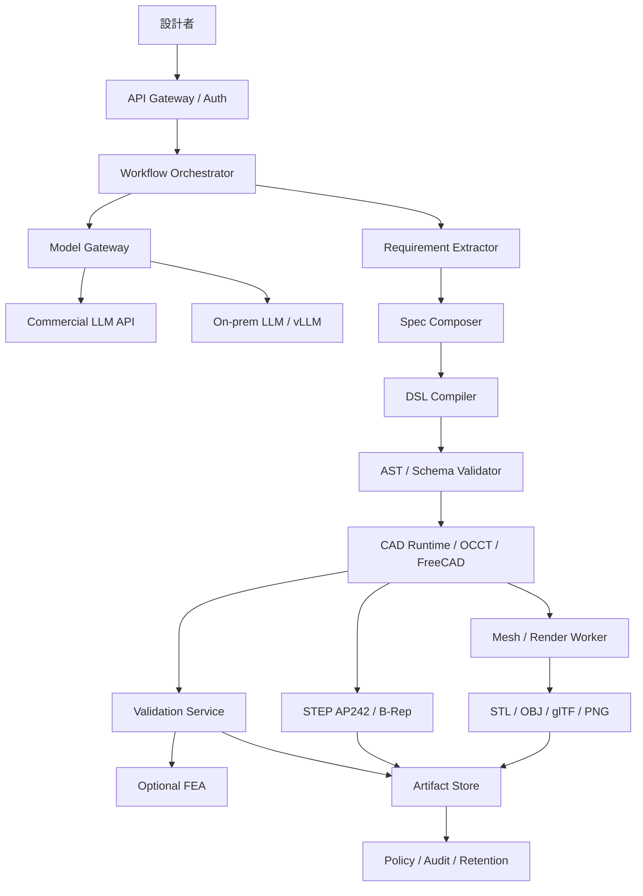

# アーキテクチャ設計

## 概要

本プラットフォームは、自然言語から直接 CAD コードを生成しません。原案が示す通り、要件、仕様、DSL、CAD 実行、検証、成果物保存を分離します。

## 主要コンポーネント

| コンポーネント | 役割 |
|---|---|
| API Gateway / Auth | 認証、案件作成、ジョブ起動、成果物取得 |
| Workflow Orchestrator | 標準フロー、修正ループ、ゲート制御 |
| Model Gateway | commercial / onprem / hybrid のルーティング |
| Rules & Retrieval | 設計規則、プリンタプロファイル、過去案件の参照 |
| DSL Compiler | Specification JSON から Parametric DSL を生成 |
| CAD Runtime | 検証済み DSL を OCCT / FreeCAD 系で実行 |
| Validation Service | 幾何、DFM/AM、組立干渉、FEA の pass/fail 判定 |
| Artifact Store | STEP、派生物、Validation Report、hash を版管理保存 |
| Policy / Audit | データ分類、輸出管理タグ、保持期間、不変ログ |

## 設計判断

- 正本形状は STEP AP242 / B-Rep とする。
- STL / OBJ は派生物であり、正本を破壊的に置き換えない。
- CAD Runtime はネットワーク分離サンドボックスで実行する。
- raw code 実行は既定禁止で、許可時も監査ログ必須とする。
- 3回以上の validation failure は人間へエスカレーションする。
