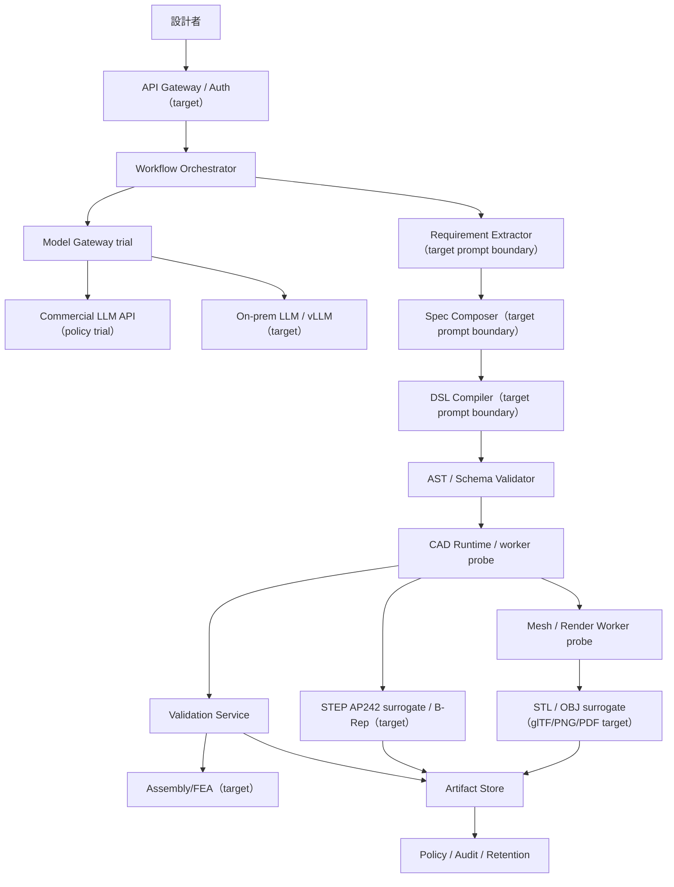

# アーキテクチャ設計

## 概要

本プラットフォームは、自然言語から直接 CAD コードを生成しません。原案が示す通り、要件、仕様、DSL、CAD 実行、検証、成果物保存を分離します。

> 本ドキュメントは target architecture を示します。現行リポジトリは PoC/Pilot 成熟度であり、実装済みなのはローカル CLI、Phase 1 PoC、Phase 2 Pilot adapter probe、DFM/AM catalog、review diff HTML、audit JSONL、Model Gateway trial です。

## 主要コンポーネント

| コンポーネント | 役割 |
|---|---|
| API Gateway / Auth | target: 認証、案件作成、ジョブ起動、成果物取得。現行 PoC/Pilot は未実装 |
| Workflow Orchestrator | 標準フロー、修正ループ、ゲート制御 |
| Model Gateway | commercial / onprem / hybrid の routing policy trial |
| Rules & Retrieval | 設計規則、プリンタプロファイル、過去案件の参照（target） |
| DSL Compiler | target: Specification JSON から Parametric DSL を生成。現行は安全境界として DSL contract を固定 |
| CAD Runtime | 検証済み DSL を実行。現行は deterministic surrogate、target は OCCT / FreeCAD 系 |
| Validation Service | 現行は幾何 proxy、DFM/AM、unit consistency。組立干渉・FEA は target |
| Artifact Store | STEP surrogate、派生物、Validation Report、hash を版管理保存 |
| Policy / Audit | データ分類、輸出管理タグ、保持期間、append-style JSONL 記録。不変ログは target |

## 設計判断

- 正本形状は STEP AP242 / B-Rep とする。
- STL / OBJ は派生物であり、正本を破壊的に置き換えない。
- CAD Runtime のネットワーク分離サンドボックス化は target であり、現行 PoC/Pilot はローカル CLI と deterministic surrogate adapter で検証する。
- raw code 実行は既定禁止で、許可時も監査ログ必須とする。
- 3回以上の validation failure は人間へエスカレーションする。
