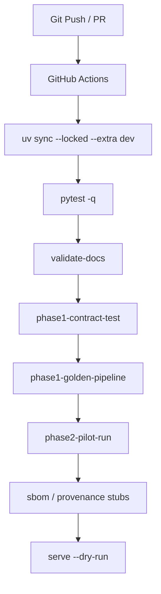

# 運用・CI/CD設計

## ローカルコマンド

このリポジトリの maintained script は文書・契約整合性チェック、Phase 1 PoC の最小パイプライン検証、Phase 2 Pilot の adapter / review / audit / gateway 検証を提供します。

```bash
bash ./run_cad_agent.sh status
bash ./run_cad_agent.sh validate-docs
bash ./run_cad_agent.sh phase1-contract-test
bash ./run_cad_agent.sh phase1-golden-pipeline
bash ./run_cad_agent.sh phase2-pilot-run
bash ./run_cad_agent.sh serve --dry-run
bash ./run_cad_agent.sh sbom --output /tmp/cad_agent_sbom.json
bash ./run_cad_agent.sh provenance --output /tmp/cad_agent_provenance.json
```

## CI/CD skeleton

現在の CI は Production v1/v2 の完全運用ではなく、GitHub Actions 上で既存の文書・契約・Phase 1/2・SBOM/provenance・serve dry-run を通す smoke workflow です。



## 実行基盤 skeleton

- 現リポジトリは Production v1/v2 実行基盤の skeleton/contract を示す。
- API server は stdlib `http.server` の local stub。
- job queue は synchronous simulation。
- CI は GitHub Actions smoke workflow。
- SBOM/provenance は決定論的 local stub。
- Production 実運用: Kubernetes、KServe/vLLM、Argo CD、Cosign/Trivy、sandbox worker pool は将来拡張。

## SLO候補

| 指標 | 初期目標 |
|---|---|
| Requirement JSON schema pass rate | 99%以上 |
| 単一部品の初回 CAD compile success rate | 80%以上 |
| Specification から STEP 生成成功率 | 95%以上 |
| Geometry validation pass rate | 98%以上 |
| Audit log 欠損率 | 0% |
| Queue p95 待ち時間 | Pilot で計測し Production v1 で固定 |

## ゴールデンケース

PoC の regression には、ブラケット、カバー、スペーサ、治具、パイプクランプ、簡易組立を使います。各ケースは Requirement / Specification / DSL / STEP / Validation Report を generation identity で束ねます。

## Phase 2 Pilot コマンド

`bash ./run_cad_agent.sh phase2-pilot-run` は、FreeCAD/OCCT と Blender が導入済みなら native executable を記録し、未導入なら deterministic surrogate adapter として結果を残します。加えて DFM/AM profile catalog、HTML review viewer、version diff、`audit_log.jsonl` の保持期間・データ分類、Model Gateway の public / confidential ルーティング試験を 1 つの report にまとめます。
