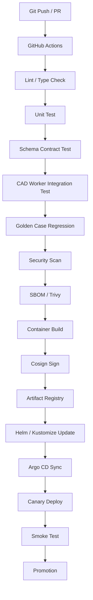

# 運用・CI/CD設計

## ローカルコマンド

このリポジトリの maintained script は文書・契約整合性チェックと Phase 1 PoC の最小パイプライン検証を提供します。

```bash
bash ./run_cad_agent.sh status
bash ./run_cad_agent.sh validate-docs
bash ./run_cad_agent.sh phase1-contract-test
bash ./run_cad_agent.sh phase1-golden-pipeline
```

## CI/CD



## 実行基盤

- LLM 推論は GPU 系リソースへ分離する。
- CAD / geometry / validation は CPU worker pool を基本にする。
- FEA は別 queue とし、長時間ジョブとして扱う。
- API は短時間同期、CAD/FEA は非同期 queue にする。
- KServe / vLLM / OpenAI-compatible API で model route を抽象化する。

## SLO候補

| 指標 | 初期目標 |
|---|---|
| Requirement JSON schema pass rate | 99%以上 |
| 単一部品の初回 CAD compile success rate | 80%以上 |
| Specification から STEP 生成成功率 | 95%以上 |
| Geometry validation pass rate | 98%以上 |
| Audit log 欠損率 | 0% |
| Queue p95 待ち時間 | Pilot で計測し Production v1 で固定 |

## ゴールデンケース

PoC の regression には、ブラケット、カバー、スペーサ、治具、パイプクランプ、簡易組立を使います。各ケースは Requirement / Specification / DSL / STEP / Validation Report を generation identity で束ねます。
